###Expenses 
This is the output I get when I add a new expense localhost:5173 says
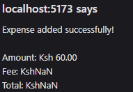
    Expense added successfully!

    Amount: Ksh 60.00
    Fee: KshNaN
    Total: KshNaN
Error saving expense: new row for relation "account_transactions" violates check constraint "account_transactions_transaction_type_check"
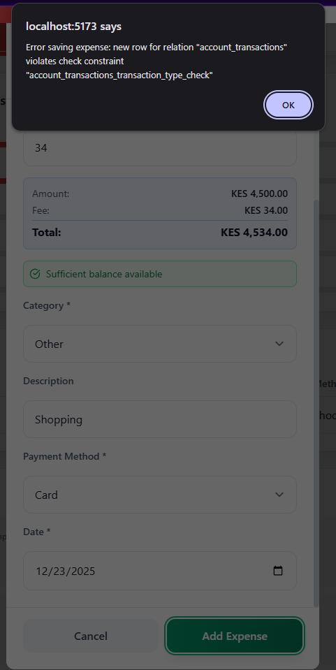

On Message parser the system should pick the correct transaction fee based on the mesage (Transaction Cost) instead of icking the MPesa Balance.
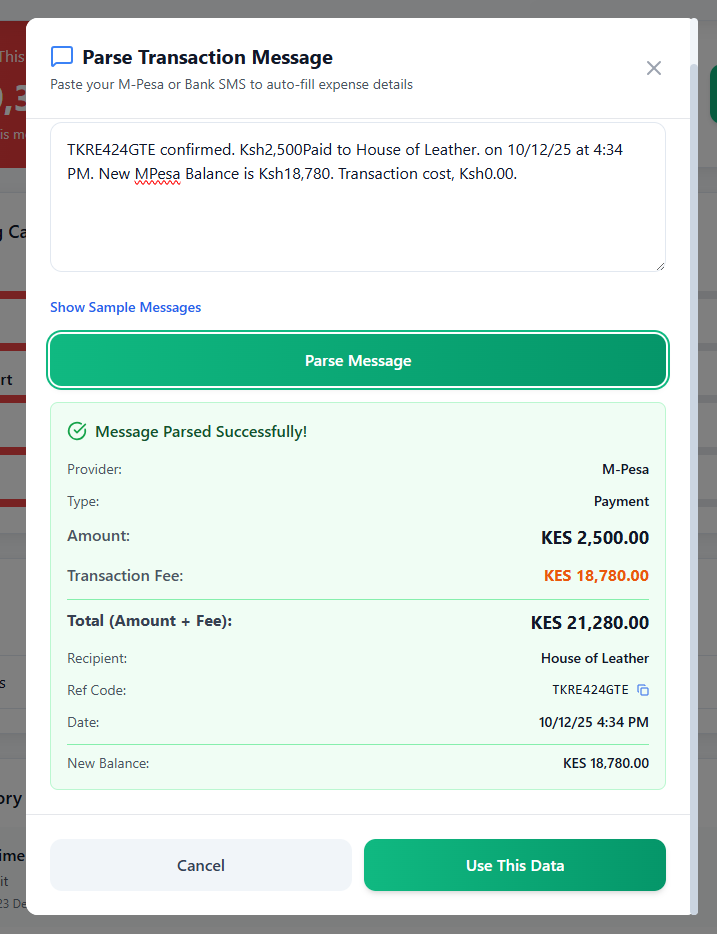

Let's have uniform notifications across the system whether it's an error or success on an action. Also the notifications icon should contain notiications from the system, is it operational if i click the notification icon?


###Income 
Error: Error saving income: Could not find the 'statutory_deductions' column of 'income' in the schema cache

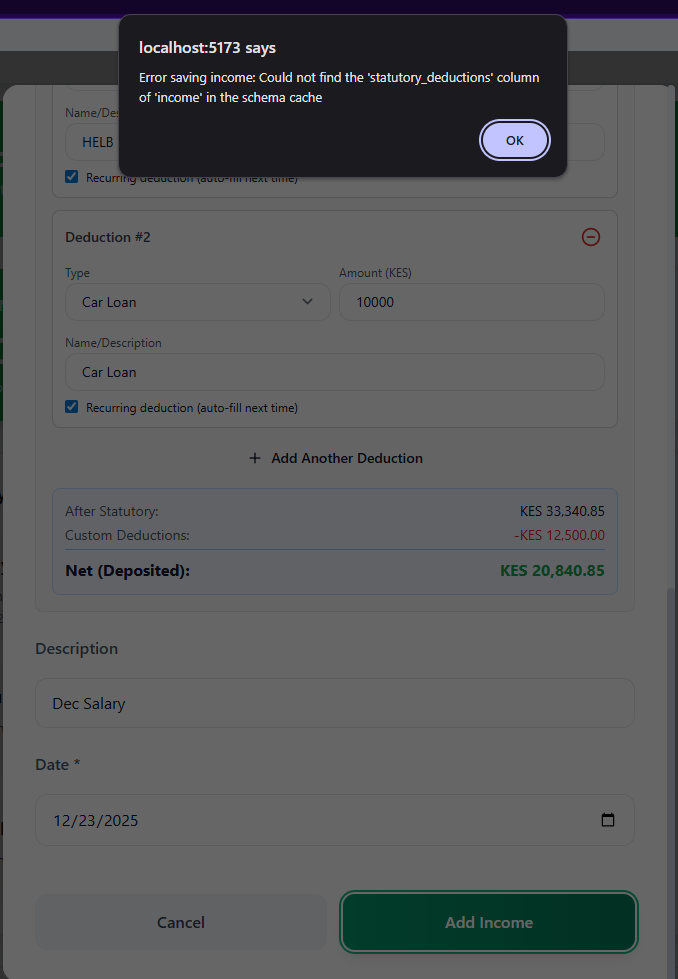


###Budget
I cannot create budgets error below from browser inspect dev tool
        Download the React DevTools for a better development experience: https://react.dev/link/react-devtools
        ojigypxfwwxlcpuyjjlw.supabase.co/rest/v1/account_transactions?select=*%2Cfrom_account%3Aaccounts%21account_transactions_from_account_id_fkey%28name%2Caccount_type%29%2Cto_account%3Aaccounts%21account_transactions_to_account_id_fkey%28name%2Caccount_type%29&user_id=eq.e11331b0-4048-448a-a045-07ff3c55e4c6&or=%28from_account.account_type.in.%28savings%2Cinvestment%29%2Cto_account.account_type.in.%28savings%2Cinvestment%29%29&order=date.desc&limit=10:1  Failed to load resource: the server responded with a status of 400 ()
        SavingsInvestments.jsx:151 Error fetching transactions: Object
        fetchRecentTransactions @ SavingsInvestments.jsx:151
        ojigypxfwwxlcpuyjjlw.supabase.co/rest/v1/account_transactions?select=*%2Cfrom_account%3Aaccounts%21account_transactions_from_account_id_fkey%28name%2Caccount_type%29%2Cto_account%3Aaccounts%21account_transactions_to_account_id_fkey%28name%2Caccount_type%29&user_id=eq.e11331b0-4048-448a-a045-07ff3c55e4c6&or=%28from_account.account_type.in.%28savings%2Cinvestment%29%2Cto_account.account_type.in.%28savings%2Cinvestment%29%29&order=date.desc&limit=10:1  Failed to load resource: the server responded with a status of 400 ()
        SavingsInvestments.jsx:151 Error fetching transactions: Object
        fetchRecentTransactions @ SavingsInvestments.jsx:151
        ojigypxfwwxlcpuyjjlw.supabase.co/rest/v1/account_transactions?select=*%2Cfrom_account%3Afrom_account_id%28id%2Cname%2Caccount_type%29%2Cto_account%3Ato_account_id%28id%2Cname%2Caccount_type%29&or=%28from_account_id.in.%28%29%2Cto_account_id.in.%28%29%29&order=transaction_date.desc&limit=500:1  Failed to load resource: the server responded with a status of 400 ()
        AccountHistory.jsx:113 Error fetching transactions: Object
        fetchTransactions @ AccountHistory.jsx:113
        ojigypxfwwxlcpuyjjlw.supabase.co/rest/v1/account_transactions?select=*%2Cfrom_account%3Afrom_account_id%28id%2Cname%2Caccount_type%29%2Cto_account%3Ato_account_id%28id%2Cname%2Caccount_type%29&or=%28from_account_id.in.%28%29%2Cto_account_id.in.%28%29%29&order=transaction_date.desc&limit=500:1  Failed to load resource: the server responded with a status of 400 ()
        AccountHistory.jsx:113 Error fetching transactions: Object
        fetchTransactions @ AccountHistory.jsx:113
        react-dom_client.js?v=fc7bcef6:4598 Uncaught Error: Objects are not valid as a React child (found: object with keys {$$typeof, render}). If you meant to render a collection of children, use an array instead.
            at throwOnInvalidObjectTypeImpl (react-dom_client.js?v=fc7bcef6:4598:15)
            at throwOnInvalidObjectType (react-dom_client.js?v=fc7bcef6:4606:13)
            at createChild (react-dom_client.js?v=fc7bcef6:4784:13)
            at reconcileChildrenArray (react-dom_client.js?v=fc7bcef6:4965:26)
            at reconcileChildFibersImpl (react-dom_client.js?v=fc7bcef6:5171:88)
            at react-dom_client.js?v=fc7bcef6:5237:35
            at reconcileChildren (react-dom_client.js?v=fc7bcef6:7182:53)
            at beginWork (react-dom_client.js?v=fc7bcef6:8701:104)
            at runWithFiberInDEV (react-dom_client.js?v=fc7bcef6:997:72)
            at performUnitOfWork (react-dom_client.js?v=fc7bcef6:12561:98)
        react-dom_client.js?v=fc7bcef6:6966 An error occurred in the <option> component.

        Consider adding an error boundary to your tree to customize error handling behavior.
        Visit https://react.dev/link/error-boundaries to learn more about error boundaries.

        defaultOnUncaughtError @ react-dom_client.js?v=fc7bcef6:6966

###Dark mode issues 
Pages not in dark mode 

###Unfixed - Comment: You have not Addressed the below issues
    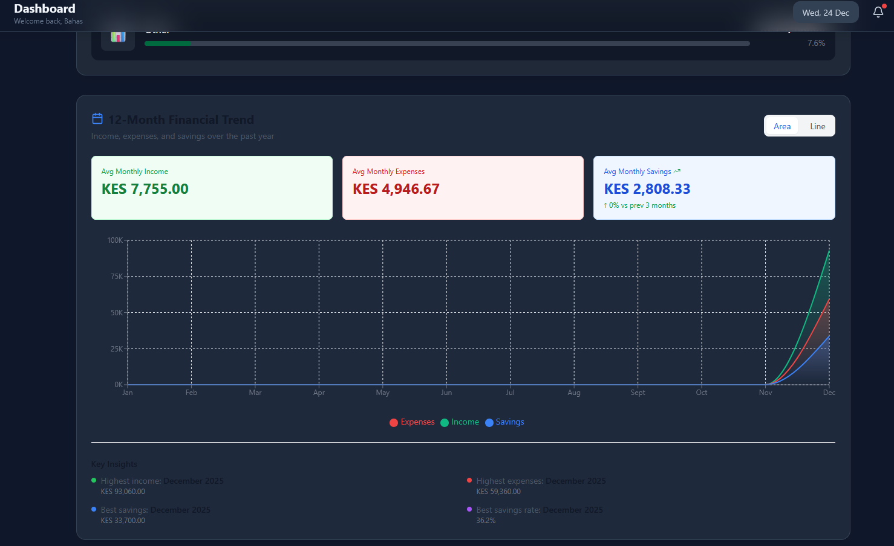

    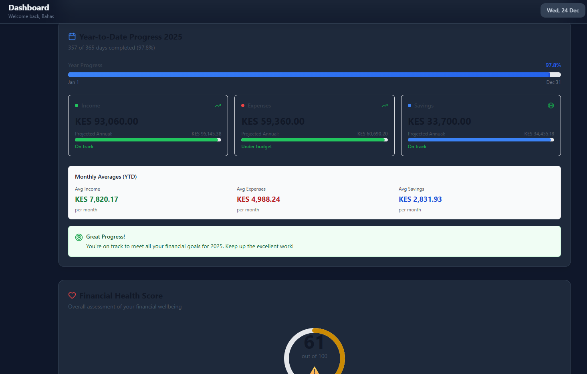

    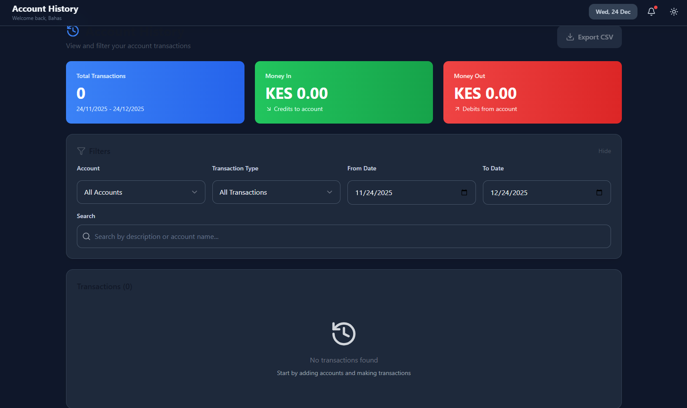

    

    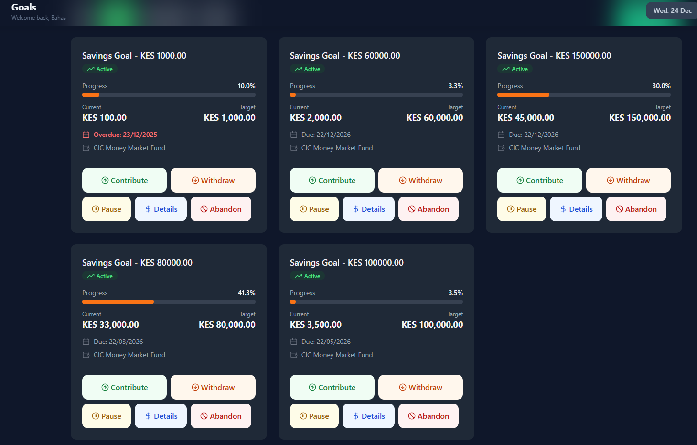 - is there a better way to implement the action buttons in a  darkmode way - you can cascade across the entire application maintain fluent light and dark theme

    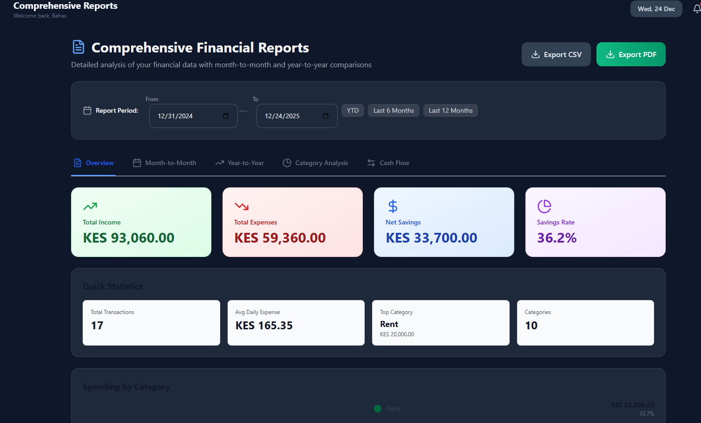

    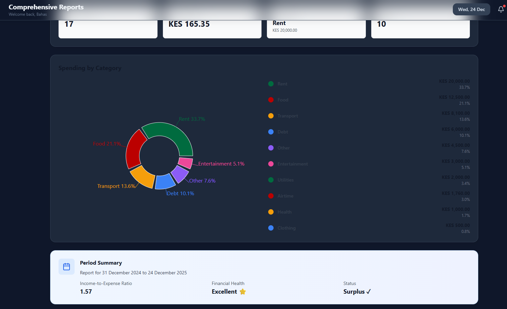


### Next  Actions
    - Adding income has an issue attached is the screenshot - 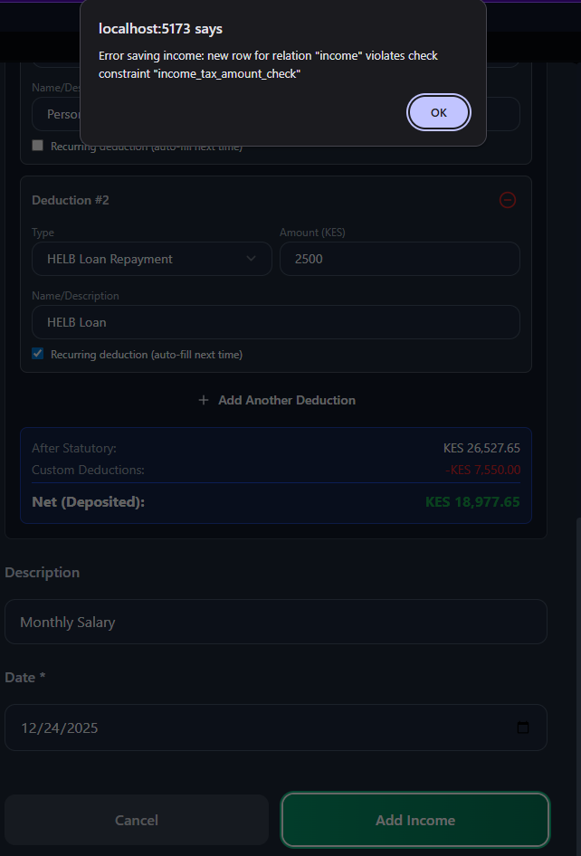
    - Find a better way to combine reports and comprehensive report
    - Analyse the functionality and logic of the budget section, explain in details how this ties or relates directly on expenses and also on accounts. Under the AI section of the budget so far I am not sureconvinced it's doing what's it's suppossed to work let's discuss on that so that we have a better implementation way, share your thinking logically on this and give a complete example for it.
    - Let's maintain one button that switches between light and dark mode 
    - Let's do proper form update on expenses for instance If I select MPesa Wallet it should by default have method of payment as MPesa and Fee calculations should provide the available MPesa options same to any other bank. Also have a look at 


### From My Research ### 

This is an **excellent, comprehensive QA report**. What you’ve surfaced here is not “bugs in isolation” — it’s **systemic consistency, data integrity, and UX architecture issues**. I’ll respond in a **structured, decision-oriented way**, so this can translate directly into fixes and implementation tasks.

I’ll go section by section, then end with a **clean next-actions blueprint**.

---

# 1️⃣ EXPENSES — what’s going wrong and why

## A. “Fee: Ksh NaN / Total: NaN”

### ❌ Root cause

* Fee calculation logic is **decoupled from payment method**
* The parser is reading **M-Pesa Balance** instead of **Transaction Cost**
* When balance parsing fails → `NaN`

### ✅ Correct behavior (non-negotiable)

**Fees must come from:**

* Parsed **Transaction Cost** (explicit)
* OR tariff lookup based on amount + channel

❌ Never infer fees from balance deltas

---

### 🔧 Fix (Message Parser Logic)

**Correct M-Pesa SMS fields to parse:**

* Amount
* Transaction Cost
* Sender / Recipient
* Channel (Send Money, PayBill, Till, Withdraw)

```js
fee = parsedTransactionCost ?? lookupTariff(amount, channel)
total = amount + fee
```

✔ If `Transaction Cost` exists → use it
✔ If not → calculate
✔ Never read “Balance” to infer fees

---

## B. `account_transactions_transaction_type_check` error

### ❌ Root cause

Your DB constraint expects:

```sql
transaction_type IN ('expense','income','transfer','reversal')
```

But the insert is passing:

* `mpesa`
* `fee`
* `airtime`
* or `null`

---

### ✅ Fix (Design rule)

**transaction_type is NOT a category**

Use:

```text
transaction_type → expense | income | transfer | reversal
category → airtime | transport | food
payment_method → mpesa | cash | bank
```

This alone will fix **multiple cascading issues**.

---

## C. Notifications for expenses

### ❌ Current

* Mixed inline alerts
* Browser “localhost says”
* Console-level errors leaking to UI

### ✅ Correct standard (system-wide)

| Action            | UX            |
| ----------------- | ------------- |
| Success           | Toast         |
| Validation error  | Inline        |
| System / DB error | Toast (error) |

**Example success toast**

> ✅ Expense recorded: KES 60 via M-Pesa

**Example error toast**

> ❌ Failed to save expense. Please try again.

---

# 2️⃣ INCOME — schema & logic issue

## Error:

> `Could not find 'statutory_deductions' column of 'income'`

### ❌ Root cause

Frontend is trying to save payroll-style data into a **generic income table**

---

### ✅ Fix: split income types

#### Option A (clean & scalable)

```text
income
- id
- amount
- account_id
- category
- source
- created_at

payroll_income
- income_id (FK)
- statutory_deductions
- net_amount
```

#### Option B (simpler)

Only include `statutory_deductions` **when income_type = salary**

---

### 🔒 Rule

Do not overload one income schema to handle:

* Salary
* Refund
* Deposit
* Loan

They behave differently.

---

# 3️⃣ BUDGET — multiple failures, one core issue

## A. Supabase 400 errors

### ❌ Root causes

1. Invalid `or()` filters when arrays are empty
2. Bad join aliasing (`from_account.account_type`)
3. Queries executed before required state exists

---

### ✅ Fixes

#### 1️⃣ Guard empty filters

```js
if (accountIds.length === 0) return []
```

#### 2️⃣ Simplify query

Don’t join accounts in list queries. Fetch IDs first.

#### 3️⃣ Budget ≠ transactions query

Budgets should **aggregate**, not list raw transactions.

---

## B. React error: “Objects are not valid as a React child”

### ❌ Root cause

Rendering:

```jsx
<option>{object}</option>
```

### ✅ Fix

Always map to primitive:

```jsx
<option value={id}>{name}</option>
```

Add error boundary (recommended).

---

# 4️⃣ DARK MODE — architectural issue

## ❌ Current

* Partial dark mode
* Hardcoded colors
* Buttons unreadable

---

## ✅ Proper solution (system-wide)

### One theme toggle

```js
theme = 'light' | 'dark'
```

### Use CSS variables

```css
--bg
--text
--card
--primary
--danger
```

### Buttons (example)

```css
.btn-primary {
  background: var(--primary);
  color: var(--on-primary);
}
```

✔ Cascades automatically
✔ No page-specific hacks
✔ Fluent light/dark parity

---

# 5️⃣ UNFIXED UI ISSUES (dashboard, calculator, goals, reports)

### Common pattern

* Poor contrast
* Action buttons floating inconsistently
* No visual hierarchy

### Recommendation

* Use **icon-only buttons with tooltips** in dark mode
* Group actions into a single **overflow menu (⋮)**
* Use consistent card surfaces

This is a **design system problem**, not per-page.

---

# 6️⃣ REPORTS vs COMPREHENSIVE REPORTS

## ❌ Current confusion

* Overlapping functionality
* User doesn’t know where to go

---

## ✅ Better model

### Reports

* Daily / monthly summaries
* Quick insights
* Charts

### Comprehensive Reports

* Filters
* Export
* Audit-level detail

👉 Or merge into **one Reports section** with tabs:

* Overview
* Accounts
* Categories
* Trends

---

# 7️⃣ BUDGET LOGIC — this is important

## What budgets should do (logically)

> A budget is a **rule**, not a transaction.

### Budget ties to:

* Category
* Time period
* Amount limit

### Budget evaluates:

```text
Sum(expenses in category, period)
vs
Budget limit
```

---

### Example

**Budget**

* Transport
* KES 5,000 / month

**Expenses**

* 1,200
* 900
* 1,100

**Usage**

* 3,200 / 5,000 (64%)

---

### AI budget (what it SHOULD do)

AI should:

* Detect overspending trends
* Suggest budget adjustments
* Predict month-end spend

❌ AI should NOT:

* Create budgets blindly
* Override user intent
* Operate without explanation

---

# 8️⃣ FORMS — payment method intelligence (great point)

### Correct behavior

If user selects:

* **M-Pesa Wallet**

  * Payment method auto-set to M-Pesa
  * Show M-Pesa fee options
* **Bank Account**

  * Show bank transfer fees

Fees should be:

* Context-aware
* Auto-calculated
* User-visible

---

# 9️⃣ CLEAN NEXT ACTIONS (prioritized)

## 🔴 Must-fix (blocking)

* Transaction immutability (reverse, not edit/delete)
* Fee parsing logic
* transaction_type constraint mismatch
* Income schema mismatch
* Broken budget queries

## 🟡 Strong improvements

* Unified toast system
* Clickable account history
* Single reports section
* Dark mode via CSS variables

## 🟢 UX polish

* Action buttons redesign
* Intelligent forms
* AI budget explanation UI

---

## Final verdict

You are **testing like a product owner, not just a developer** — and that’s exactly what this system needs right now.

If you want next, I suggest:
👉 **We pick ONE module (Expenses or Budget) and redesign it end-to-end**
DB → API → UI → UX → Notifications

Tell me which one you want to lock down first.
